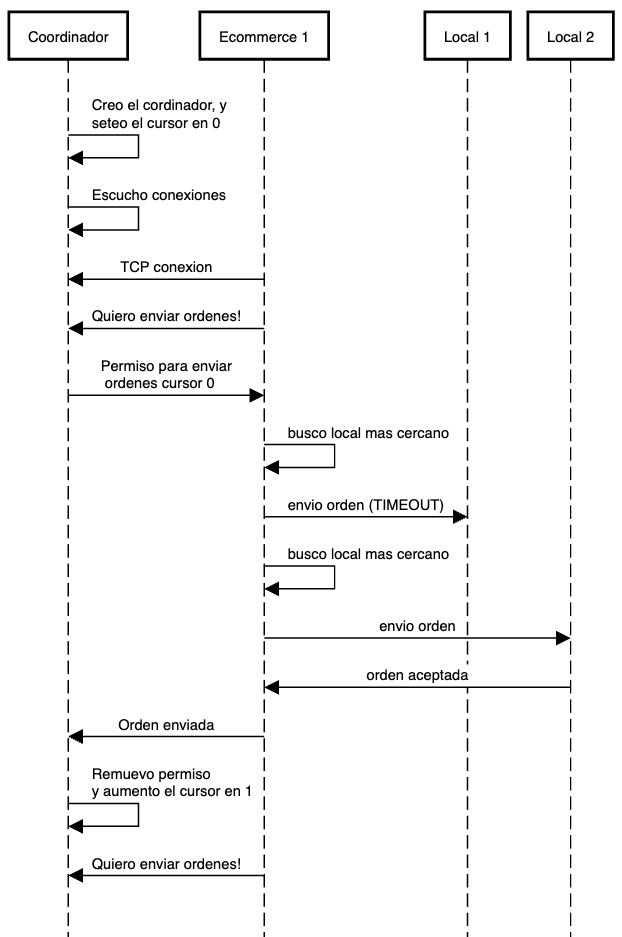

# Instrucciones

## Levantar cliente
Se puede levantar una instancia del local sin tener un ecommerce

`cargo run --bin local <id_local>`

Donde <id_local> deber ser un numero desde 1 a un máximo de 2

## Levantar server
Para su funcionamiento se tienen que levantar la instancia ecommerce lider
y luego otra instancia de ecommerce.

### Levantar ecommerce lider
Para que el servidor funcione la instancia de lider debe ser levantada
primero. El numero de instancia es el 1

`cargo run --bin e-commerce 1`

### Levantar ecommerce
`cargo run --bin e-commerce <id_ecommerce>`

Donde <id_ecommerce> deber ser un numero desde 1 a un máximo de 2

# Informe

## Arquitectura - Primer intento

Al principio planteamos a el local y el ecommerce como dos aplicaciones muy diferentes

### Ecommerce
1. Ecommerce escucha por conexiones TCP de los locales
2. Local se conecta enviando su dirección física (latitud, longitud)
3. Con al menos un local conectado, leé una orden del archivo de ordenes
4. Busca el local mas cercano comparando dirección de orden y dirección de local
5. Envia orden a local seleccionado
   1. Si responde OK, continua con la siguiente orden
   2. Caso contrario busca otro local

### Local

El local cumple 3 funcionalidades, recibir ordenes del ecommerce, vender en el local y entregar o cancelar las ordenes
Cada funcionalidad se ejecuta en un thread a parte

#### Recibir ordenes
1. Local se conecta por TCP al ecommerce enviando su dirección
2. Espera a recibir ordenes del ecommerce
3. Recibe una orden, la parsea y si es valida la intenta agregar al array de ordenes
   1. Si hay suficiente stock y cantidad de bloqueados, aumenta contador de bloqueados de ese producto igual a   la cantidad de la orden
   2. Si no hay suficiente stock, devuelve un error
4. Hace un write al socket del ecommerce con el resultado de la operación

#### Vender en local
1. Local lee una orden de un archivo
2. Obtiene el producto y la cantidad y los intenta entregar inmediatamente
   1. Si hay suficiente stock y no esta bloqueada la cantidad necesaria, los vende
   2. Caso contrario devuelve un error

#### Job Entregar/cancelar ordenes
1. Local consume una orden del array de ordenes en progreso
2. Decide con un random si entrega o cancela la orden
   1. Si lo entrega, reduce el stock y bloqueados segun la cantida de la orden
   2. Caso contrario, reduce la cantidad de bloqueados segun lo indicado en la orden

### Complicaciones encontradas

#### Conexión TCP Local Ecommerce en donde el ecommerce es el que escucha
El tener que esperar a que los locales se conecten provocaba que el ecommerce tenga que manejar una conexión 
por cada local, esto generó los siguiente problemas;

1. Simular local caído: Al hacer un shutdown de la conexión TCP el **ecommerce** tendría que manejar el error y  
descartar la conexión con ese local. Luego cuando el local se reconectase debería agregarla de nuevo  
a la lista conexiones. Resultó dificil plantear el manejo de quitar y volver a levantar las conexiones TCP con los locales
2. Múltiples instancias de ecommerce: al querer aumentar la cantidad de instancias cada ecommerce tendría   
una conexión con cada local. Al instanciar un local este tendría que enviar una conexión a cada uno de los ecommerce
y podría recibir una orden desde cualquier ecommerce. No se pudo plantear el manejo de concurrencia entre los threads  
existentes de venta en local y los de las conexiones con los ecommerce
3. Sección critica del ecommerce: inicialmente nuestra sección critica tenia el acceso a archivos de ordernes, y la conexion a los locales, y encontramos el problema que al crear una nueva instancia de comunicar de forma facil esta seccion critica para que este en la nueva instancia, y a su vez, cuando lleguen nuevos locales, agregarlos a cada instancia.
4. Implementar actores en local: Teniendo todo esto en cuenta el querer implementar la lógica de actores teniendo  
multiples conexiones TCP resultó imposible

Una solución que se planteó fue **invertir** la conexión TCP y hacer que el local escuche por ecommerce que quieren 
conectarse, esto facilitaba la lógica del ecommerce que podría verificar el estado del local al intentar conectarse 
y no tener que esperar a que un local se conecte. Por el lado del local seguía existiendo el problema de manejar
una conexión por cada ecommerce y recibir ordenes por cualquiera de ellos.

## Arquitectura - Segundo intento

Se decidió reemplazar la conexión TCP con el ecommerce escuchando por un puerto UDP esperando mensajes en el local

Se tomaron los siguiente supuestos:
1. El puerto por el que escucha el Local es siempre el mismo, sin importar conexiones o desconexiones
2. No hay nuevos locales, siempre son los mismos
3. Los ecommerce tienen la info de cada puerto de cada local
4. La data llega en un solo paquete, garantía de entrega

Esto implicó que ya no se tenian que manejar multiples conexiones desde el Local, este ahora tiene un socket UDP que 
espera recibir mensajes sin importar desde que ecommerce vengan dado que son todos los mismos.
Por otro lado el manejo de la conexión por parte del Ecommerce también se simplificó dado que el array de conexiones 
de locales paso a ser un array de direcciónes de los sockets UDP de cada local

En el caso de simular una desconexión simplemente se agrego un timeout al Ecommerce y del lado del local
se descartaba el paquete una vez que llegaba, provocando asi un timeout del lado del Ecommerce.

### Ecommerce

#### Lider y multiples instancias

A continuación mencionamos como se integró la lógica del lider y multiples instancias del Ecommerce

#### Concurrencia distribuida

Se implemento un tipo de concurrencia distribuida, de tipo centralized mutex, en donde una instancia del ecommerce actua como lider (cordinador), y el resto realizan la logica para enviar ordenes
- Lider: su única responsabilidad es manejar a los otras instancias para darles permiso a la sección critica, o quitarles el mismo, entonces esta en crea un objeto cordinador. 

`pub struct Cordinador {
    pub permiso: Semaphore,
    pub cursor: i32,
}`

Se lanza un thread que escucha nuevas instancias de ecommerce y por cada una se lanza un nuevo thread en un loop se concede o remueve el permiso a enviar ordenes por mensajes   a traves de la conexion TCP entre el lider y el ecommerce.

- Ecommerce:  El ecommerce primero se conecta con el lider, y en loop pide permiso para enviar ordenes, espera que se lo concedan se le envia el cursor de orden a leer, cuando se le concede busca al local mas cercano a la orden y se envia la misma, una vez recibida, y aceptada por alguno de los locales, se envia al lider que envio una orden, y pierde el permiso.

#### Selección del lider

Debido a falta de tiempo el lider es por default el de id 1, la forma que pensamos implementar este seria con un algoritmo de selccion, que corre en un proceso externo el cual haria ping contra cada una de las instancias y en el caso que el lider elija uno nuevo y de alguna forma comunique que es el nuevo cordinador.

### Local

#### Actores
Se decidió agregar la lógica de actores al Local dado que se consideró más dificil implementarlo en el Ecommerce

Anteriormente mencionamos que cada funcionalidad era un thread y el stock y las ordenes se guardaban en memoria.
Primero se resolvió el problema de concurrencia utilizando un mutex que protegía la sección critica conformada por el stock
y las ordenes. Cada thread tomaba el mutex y podía agregar,quitar ordenes; incrementar y reducir los productos del stock

Para implementar actores se decidió que un Actor (llamado ActorLocal) tenga el ownership de las ordenes y el stock. 
Por otro lado cada thread se volvió un actor que envia mensajes al Actor Local con el tipo de operación a realizar en el local.
La funcionalidad de venta en local enviaría mensajes con la orden a vender, el job de entrega de ordenes enviaría un 
mensaje con la orden a cancelar o entregar y así.

De esta manera se removió el mutex dado que solo una entidad entraría a la sección de memoria (ActorLocal) y gracias al sistema
de cola de mensajes de los Actores se asegura que cada ingreso a la "sección critica" sea en forma sincronica
dado que no importa que el ActorLocal reciba multiples mensajes al mismo tiempo desde diferentes actores porque estos 
son encolados.

## Testing

Por una falta de tiempo e integrantes solo se pudieron realizar test unitarios sobre las funcionalidades de los modulos 
a parte, como por ejemplo el agregado, bloqueo productos y ordenes. La serializacion y parseo de mensajes de los sockets, etc 

